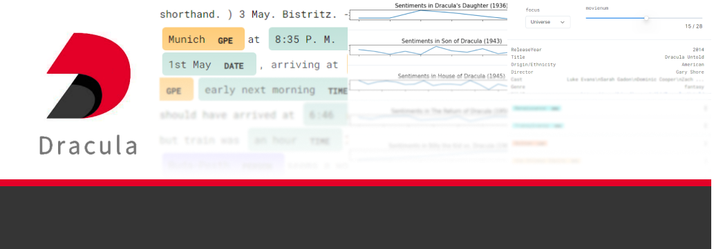

# A Halloween treat: what is the best Dracula movie for you to watch?
## case study of a novel and its numerous movie adaptations, using automatic extraction of sentiments and named entities with spaCy

[contest details](https://deepnote.notion.site/NLP-in-Notebooks-Competition-6616e415f0a44e5c95982e7bc1cb89dd) - [contest results](https://community.deepnote.com/c/announcements/nlp-in-notebooks-competition-results) - [my submission](https://community.deepnote.com/c/showcase/a-halloween-treat-what-is-the-best-dracula-movie-for-you-to-watch)

entry for the Deepnote + spaCy: NLP in Notebooks Competition, won 3rd place
